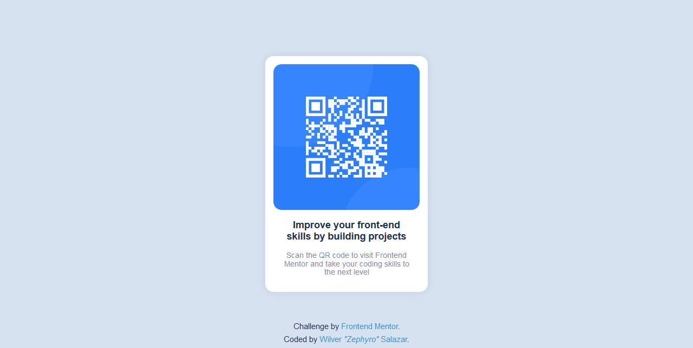

# Frontend Mentor - QR code component solution

This is a solution to the [QR code component challenge on Frontend Mentor](https://www.frontendmentor.io/challenges/qr-code-component-iux_sIO_H).

## Table of contents

- [Overview](#overview)
  - [Screenshot](#screenshot)
  - [Links](#links)
- [My process](#my-process)
  - [Built with](#built-with)
- [Author](#author)

## Overview

### Screenshot

### Links

- Solution URL: [QR Code Card - URL](https://github.com/zephyrocode/qr-code-card/)
- Live Site URL: [QR Code Card - Site](https://zephyrocode.github.io/qr-code-card/)

## My process

### Built with

- Semantic HTML5 markup
- CSS custom properties
- Flexbox
- Mobile-first workflow

## Author

- Website - [Zephyro Code](https://zephyrocode.netlify.app/ "Zephyro Code Website")
- Discord - [@Wilver#7456](https://discordapp.com/users/271083466890674176/ "Zephyro's Discord")
